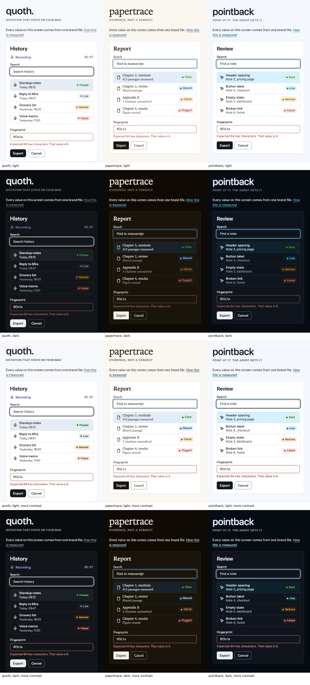

# The brand tier, rendered and certified

The one-off record of the first render of the three product brands, taken on 2026-09-21 when the brand tier landed; not maintained.
The release step that replaces it on every tag is in [AGENTS.md](../AGENTS.md#releasing).

## How it was taken

Each cell is [examples/specimen.html](../examples/specimen.html) opened on its own page in a headless Chromium browser (Brave), served over a local http origin, with the brand's emitted `tokens/tokens.css` and, for quoth, `quoth.tokens.css`.
The two more-contrast rows are the files' own `@media (prefers-contrast: more)` blocks, applied by `&contrast=more`, because the driver could not emulate the media feature.
The image is four rows of 420px screenshots, written with every PNG chunk but the image data removed.

## What the browser painted, certified

Every hw- colour was read back as the browser's CSS engine resolves it into sRGB, through `color-mix(in srgb, ...)`, and rounded to 8 bits.
A canvas read-back was tried first and refused as evidence: it passes through the compositor's colour management, and paints `oklch(1 0 255)` as `255, 254, 254`.

All 99 certified pairs per cell held their bar in all 12 cells, and so did every painted separation bar.
The worst value per product, default tiers and then more-contrast tiers:

| brand | text | non-text | accent ink | selected fill | ring from danger | ring from border | fill from ground |
|---|---:|---:|---:|---:|---:|---:|---:|
| quoth | 4.541 / 7.017 | 3.024 / 4.502 | 29.2 / 28.5 | 12.4 / 12.4 | 35.5 / 29.9 | 36.6 / 25.3 | 10.0 / 10.0 |
| papertrace | 4.564 / 7.020 | 3.014 / 4.514 | 39.7 / 34.1 | 14.8 / 14.8 | 39.1 / 39.6 | 27.0 / 25.7 | 7.9 / 7.9 |
| pointback | 4.564 / 7.020 | 3.021 / 4.516 | 34.9 / 30.8 | 14.1 / 14.1 | 45.8 / 42.0 | 24.7 / 22.5 | 11.0 / 11.0 |

`--quoth-live` held 4.526:1 on quoth's six surfaces in the default tiers and 7.021:1 under more contrast.
The bars are 4.5 and 3 for text and non-text, 7 and 4.5 under more contrast, and 14, 5, 17, 14 and 6 CIEDE2000 for the five painted distances.
